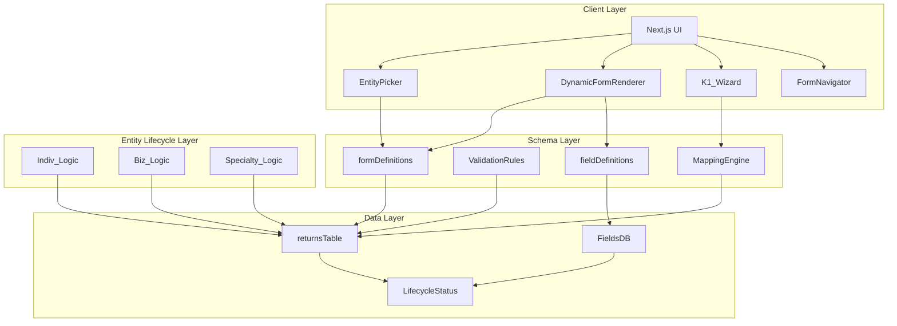

# TaxWise Clone - Metadata-Driven Form Engine Implementation Plan

## Executive Summary

This document outlines the comprehensive implementation plan for building a **Metadata-Driven Form Engine** within the TaxWise Clone project. The objective is to create a flexible, maintainable tax preparation system that replicates the functionality of legacy tax software while leveraging modern technologies including Next.js 14+ (App Router), Convex for real-time data management, and LLM-driven logic for enhanced automation.

The Metadata-Driven Form Engine represents a fundamental architectural shift from hard-coded tax forms to a schema-driven approach where IRS forms are defined as JSON blueprints. This enables:
- **Dynamic Form Rendering**: Forms are generated from metadata rather than static UI components
- **Cross-Form Flow-Through**: Automatic propagation of values between related forms (W2 → 1040, SchC → 1040, K-1 ↔ 1065/1120S)
- **Entity-Specific Logic**: Tailored workflows for Individual (1040), Business (1065/1120S), and Specialty (990/706/709) returns
- **MeF Integration**: Seamless electronic filing through the Modernized e-File (MeF) gateway
- **Real-Time Validation**: IRS business rule validation at point of entry

---

## Architecture Overview

The Metadata-Driven Form Engine follows a four-layer architecture designed for separation of concerns, testability, and maintainability:



### Layer Responsibilities

| Layer | Components | Responsibilities |
|-------|------------|------------------|
| **Client Layer** | EntityPicker, DynamicFormRenderer, K1_Wizard, FormNavigator | User interface for form entry, entity selection, K-1 management, and TaxWise-style navigation |
| **Schema Layer** | formDefinitions, ValidationRules, MappingEngine, fieldDefinitions | JSON schemas for IRS forms, validation logic, cross-form field mapping, field metadata |
| **Data Layer** | returnsTable, FieldsDB, LifecycleStatus | Convex document stores for returns, field values, and filing status tracking |
| **Entity Lifecycle Layer** | Indiv_Logic, Biz_Logic, Specialty_Logic | Entity-type-specific business rules and workflows |

---

## Existing Project Analysis

### Current Convex Schema Tables

The existing [`convex/schema.ts`](convex/schema.ts) contains the following tables:

| Table | Purpose |
|-------|---------|
| `returns` | Tax return metadata (name, taxYear, status) |
| `formInstances` | Individual form instances within a return (W2, 1040, SchC, etc.) |
| `fields` | Field values for each form instance (Box1, Line1z, etc.) |
| `formFields` | Interview mode field metadata with validation rules |
| `diagnostics` | Error/warning messages for tax return |
| `auditLogs` | User action tracking |
| `mefSubmissions` | MeF transmission tracking and status |
| `translations` | Bilingual (EN/ES) support |
| `taxTotals` | Running totals for incremental sum tracking |

### Existing Calculation Engine

The [`convex/calculations.ts`](convex/calculations.ts) module implements the flow-through calculation engine with the following capabilities:

1. **W2 → 1040 Flow-Through**: Aggregates all W-2 Box 1 wages to 1040 Line 1z
2. **Schedule C Integration**: Calculates SE Tax from SchC net profit
3. **Standard Deduction**: Determines whether to use standard or itemized deductions
4. **Taxable Income Calculation**: Computes AGI, deduction, QBI deduction, and final taxable income
5. **Tax Liability**: Applies federal tax brackets, Child Tax Credit, and calculates final liability

Key functions:
- [`calculateReturnDependencies()`](convex/calculations.ts:9) - Main dependency engine
- [`recalculateReturn()`](convex/calculations.ts:177) - Public mutation trigger

### Tax Math Libraries

The [`lib/taxMath/`](lib/taxMath/) directory contains pure TypeScript tax calculation functions:

| Module | Functions |
|--------|-----------|
| [`standardDeduction.ts`](lib/taxMath/standardDeduction.ts) | `calculateStandardDeduction()` - 2023/2025 standard deductions by filing status |
| [`taxCalculation.ts`](lib/taxMath/taxCalculation.ts) | `calculateFederalTax()`, `calculateQBIDeduction()`, `calculateChildTaxCredit()` |
| [`seTax.ts`](lib/taxMath/seTax.ts) | `calculateSETax()` - Self-employment tax with SS/Medicare portions |

### MeF Engine

The [`convex/mefEngine.ts`](convex/mefEngine.ts) provides:

- **Business Rule Validation**: MeF-specific rules (R1001-R3001) for form validation
- **XML Generation**: IRS-compliant XML generation for MeF transmission
- **Transmission Layer**: SOAP/WSDL interface for IRS gateway communication
- **Status Tracking**: Submission status tracking with IRS acknowledgment codes

### Diagnostics Infrastructure

The [`convex/diagnostics.ts`](convex/diagnostics.ts) module provides:
- Per-return diagnostic message storage
- Bilingual translation support for diagnostic messages
- Integration with MeF validation results

---

## Schema Extensions

The following new tables must be added to [`convex/schema.ts`](convex/schema.ts) to support the Metadata-Driven Form Engine:

### formDefinitions

JSON schema blueprints for IRS forms, enabling dynamic form rendering:

```typescript
formDefinitions: defineTable({
  formType: v.string(),           // e.g., "1040", "1120", "SchC"
  taxYear: v.number(),           // Tax year applicability
  version: v.string(),            // Form version (e.g., "2025v1.0")
  title: v.string(),              // Form title
  schema: v.any(),                // JSON schema for form structure
  sections: v.array(v.object({    // Form sections/layout
    sectionId: v.string(),
    title: v.string(),
    fields: v.array(v.string()),  // Field keys in this section
  })),
  dependencies: v.optional(v.array(v.object({
    sourceField: v.string(),
    targetField: v.string(),
    formula: v.string(),         // JavaScript expression
  }))),
  mefXMLPath: v.optional(v.string()), // XML path for MeF generation
}).index("by_formType_year", ["formType", "taxYear"])
```

### fieldDefinitions

Field metadata with formulas, dependencies, and visibility rules:

```typescript
fieldDefinitions: defineTable({
  fieldKey: v.string(),          // e.g., "1040_Line1z", "Box1"
  formType: v.string(),           // Parent form
  label: v.string(),              // Field label (EN)
  labelEs: v.optional(v.string()), // Spanish label
  inputType: v.string(),          // "currency", "number", "text", "boolean", "date"
  validation: v.optional(v.object({
    required: v.boolean(),
    min: v.number(),
    max: v.number(),
    pattern: v.string(),
  })),
  formula: v.optional(v.string()), // Calculation formula
  dependencies: v.optional(v.array(v.string())), // Required fields
  visibilityRules: v.optional(v.array(v.object({
    field: v.string(),
    operator: v.string(),
    value: v.any(),
  }))),
  mefXMLNode: v.optional(v.string()), // XML node name for MeF
  helpText: v.optional(v.string()),
  helpTextEs: v.optional(v.string()),
}).index("by_formType", ["formType"]).index("by_fieldKey", ["fieldKey"])
```

### validationRules

Reusable IRS business rules that can be applied across forms:

```typescript
validationRules: defineTable({
  ruleId: v.string(),             // e.g., "IRS_1040_R001"
  category: v.string(),           // "income", "deduction", "credit", "mef"
  severity: v.string(),            // "error", "warning", "info"
  description: v.string(),
  formula: v.string(),             // Validation expression
  errorMessage: v.string(),
  errorMessageEs: v.optional(v.string()),
  forms: v.array(v.string()),     // Applicable forms
  effectiveDate: v.number(),      // Rule effective date
  expirationDate: v.optional(v.number()),
}).index("by_category", ["category"]).index("by_ruleId", ["ruleId"])
```

### mappingEngine

Cross-form field mapping including K-1 synchronization:

```typescript
mappingEngine: defineTable({
  mappingId: v.string(),
  sourceForm: v.string(),        // Source form type
  sourceField: v.string(),        // Source field key
  targetForm: v.string(),         // Target form type
  targetField: v.string(),        // Target field key
  mappingType: v.string(),        // "flow_through", "k1_sync", "calculation"
  transform: v.optional(v.string()), // Optional transformation
  isActive: v.boolean(),
}).index("by_source", ["sourceForm", "sourceField"])
  .index("by_target", ["targetForm", "targetField"])
```

### k1Records

K-1 pass-through data for partnership/S-corporation returns:

```typescript
k1Records: defineTable({
  returnId: v.id("returns"),
  entityId: v.id("formInstances"), // 1065 or 1120S instance
  recipientTIN: v.string(),        // Recipient's TIN
  recipientName: v.string(),
  entityName: v.string(),          // Partnership/S-corp name
  ein: v.string(),
  // Income items
  ordinaryBusinessIncome: v.number(),
  guaranteedPayments: v.number(),
  interestIncome: v.number(),
  dividendIncome: v.number(),
  royaltryIncome: v.number(),
  capitalGainLoss: v.number(),
  section179Deduction: v.number(),
  otherDeductions: v.number(),
  // Ownership
  ownershipPercentage: v.number(),
  // Status
  status: v.string(),              // "draft", "final", "transmitted"
  createdAt: v.number(),
  updatedAt: v.number(),
}).index("by_return", ["returnId"]).index("by_entity", ["entityId"])
```

### LifecycleStatus

Entity lifecycle status tracking:

```typescript
lifecycleStatus: defineTable({
  returnId: v.id("returns"),
  entityType: v.string(),          // "individual", "business", "specialty"
  currentPhase: v.string(),         // "data_collection", "review", "filing", "accepted"
  completedPhases: v.array(v.string()),
  blockers: v.optional(v.array(v.string())),
  lastUpdated: v.number(),
  assignedPreparer: v.optional(v.string()),
}).index("by_return", ["returnId"])
```

---

## Implementation Phases

### Phase 1: Metadata-Driven Form Engine (Weeks 1-6)

**Objective**: Build the core metadata infrastructure enabling dynamic form rendering

#### Week 1-2: Schema Layer Foundation
- [ ] Add new tables to `convex/schema.ts`
- [ ] Create formDefinitions seed data for core 1040 fields
- [ ] Build fieldDefinitions for W2, 1040 basic lines
- [ ] Set up indexes for efficient querying

#### Week 3-4: Dynamic Form Renderer
- [ ] Implement DynamicFormRenderer React component
- [ ] Create JSON-schema-to-React mapping
- [ ] Build field input components (currency, number, text, boolean)
- [ ] Implement conditional field visibility

#### Week 5-6: Calculation Engine Integration
- [ ] Connect formDefinitions to calculations.ts
- [ ] Implement formula evaluation for computed fields
- [ ] Add dependency tracking for cascading updates
- [ ] Build real-time recalculation triggers

**Deliverables**:
- formDefinitions and fieldDefinitions tables populated
- DynamicFormRenderer component functional
- Basic 1040 form rendered from metadata
- Flow-through calculations working

---

### Phase 2: Entity-Specific Logic (Weeks 7-12)

**Objective**: Implement entity-type-specific workflows and calculations

#### Week 7-8: Individual Entity Logic
- [ ] Extend calculations.ts for Schedule A (itemized deductions)
- [ ] Implement Schedule D (capital gains) logic
- [ ] Add Schedule E (rental income) support
- [ ] Build filing status-specific workflows

#### Week 9-10: Business Entity Logic
- [ ] Implement Form 1065 (Partnership) calculations
- [ ] Build Form 1120S (S-Corporation) calculations
- [ ] Add partnership/S-corp-specific deductions
- [ ] Implement profit/loss distribution logic

#### Week 11-12: Specialty Entity Logic
- [ ] Add Form 990 (Tax-Exempt Organization) support
- [ ] Implement Form 706 (Estate Tax) calculations
- [ ] Build Form 709 (Gift Tax) logic
- [ ] Create specialty checklist requirements

**Deliverables**:
- Complete Individual (1040/SR/NR) calculations
- Business entity (1065/1120S) support
- Specialty form (990/706/709) infrastructure
- EntityPicker component functional

---

### Phase 3: K-1 Pass-Through Syncing (Weeks 13-16)

**Objective**: Implement K-1 data flow between business entities and individual returns

#### Week 13-14: K-1 Data Model
- [ ] Build k1Records table CRUD operations
- [ ] Create K1_Wizard React component
- [ ] Implement K-1 import from PDF/OCR
- [ ] Build validation K-1 data15-16:

#### Week irectional Sync
- [ ] Implement  Bid1065/1120S → K-1 generation
- [ ] Build K-1 → 1040 Schedule E flow-through
- [ ] Handle multiple K-1 recipients
- [ ] Add K-1 circularity detection

**Deliverables**:
- k1Records table and operations
- K1_Wizard component for import/export
- K-1 to Schedule E integration
- Multi-recipient K-1 support

---

### Phase 4: Lifecycle Status Management (Weeks 17-20)

**Objective**: Implement comprehensive lifecycle tracking and status management

#### Week 17-18: Lifecycle Framework
- [ ] Build lifecycleStatus table operations
- [ ] Create phase transition logic
- [ ] Implement blocker detection
- [ ] Add preparer assignment

#### Week 19-20: Integration & Reporting
- [ ] Integrate lifecycle with all entity types
- [ ] Build progress dashboard
- [ ] Add completion checklists
- [ ] Implement export/status reporting

**Deliverables**:
- Complete lifecycle tracking
- Phase-based workflow enforcement
- Progress dashboard UI
- Audit-ready status reporting

---

## Component Specifications

### DynamicFormRenderer

The core component for rendering IRS forms from JSON metadata:

```typescript
interface DynamicFormRendererProps {
  formDefinitionId: string;
  returnId: string;
  instanceId: string;
  mode: "edit" | "view" | "print";
  onFieldChange?: (fieldKey: string, value: any) => void;
  locale?: "en" | "es";
}
```

**Features**:
- Renders form sections from formDefinitions schema
- Applies fieldDefinitions for validation and labels
- Handles computed fields via formula evaluation
- Supports conditional visibility based on field values
- Integrates with diagnostics for error display

### EntityPicker

Tax entity type selector component:

```typescript
interface EntityPickerProps {
  selectedEntity?: EntityType;
  onSelect: (entity: EntityType) => void;
  disabled?: boolean;
}

type EntityType = "individual" | "partnership" | "scorporation" | 
                  "corporation" | "estate" | "trust" | "exempt_organization";
```

**Features**:
- Visual entity type selection
- Filing type context (1040, 1065, 1120, 990, 706, 709)
- Guidance text for each entity type

### K1Wizard

K-1 import/export interface:

```typescript
interface K1WizardProps {
  returnId: string;
  entityId: string;
  onComplete: (k1Records: K1Record[]) => void;
}
```

**Features**:
- Multi-step K-1 data entry
- OCR import from K-1 PDF
- Recipient management
- Preview before saving

### FormNavigator

TaxWise-style form tree navigation:

```typescript
interface FormNavigatorProps {
  returnId: string;
  activeForm?: string;
  onSelectForm: (formType: string) => void;
}
```

**Features**:
- Hierarchical form tree display
- Form completion status indicators
- Quick navigation to required forms
- Entity-specific form sets

---

## Integration Points

### formDefinitions ↔ calculations.ts Integration

The metadata-driven approach extends the existing calculation engine:

1. **Formula Storage**: Formulas defined in fieldDefinitions.formula are loaded at runtime
2. **Evaluation Context**: calculations.ts provides the evaluation context with access to all field values
3. **Dependency Graph**: Build dependency graph from fieldDefinitions.dependencies for optimal recalculation order

```typescript
// Example integration pattern
const fieldDef = await ctx.db.query("fieldDefinitions")
  .withIndex("by_fieldKey", q => q.eq("fieldKey", targetField))
  .first();

if (fieldDef?.formula) {
  const result = evaluateFormula(fieldDef.formula, fieldValues);
  await setFieldValue(targetField, result);
}
```

### validationRules ↔ diagnostics.ts Integration

Validation rules extend the existing diagnostics infrastructure:

1. **Rule Loading**: Load applicable rules from validationRules table based on form type
2. **Real-Time Validation**: Validate on field blur and on form submission
3. **Message Integration**: Use existing diagnostic message system with bilingual support

```typescript
// Integration pattern
const rules = await ctx.db.query("validationRules")
  .filter(q => q.eq(q.field("forms"), formType))
  .collect();

for (const rule of rules) {
  const isValid = evaluateRule(rule.formula, fieldValues);
  if (!isValid) {
    await addDiagnostic({
      message: rule.errorMessage,
      severity: rule.severity,
      fieldKey: rule.fieldKey,
    });
  }
}
```

### mappingEngine ↔ mefEngine.ts Integration

Field mapping enables cross-form data flow for MeF XML generation:

1. **Mapping Resolution**: When generating XML, resolve source fields via mappingEngine
2. **Transform Support**: Apply transforms (sum, multiply, format) as defined
3. **K-1 Sync**: Special handling for K-1 fields in MeF XML

```typescript
// Integration pattern
const mappings = await ctx.db.query("mappingEngine")
  .withIndex("by_target", q => q.eq("targetForm", targetForm))
  .collect();

for (const mapping of mappings) {
  const sourceValue = getFieldValue(mapping.sourceForm, mapping.sourceField);
  const transformedValue = applyTransform(sourceValue, mapping.transform);
  setFieldValue(mapping.targetForm, mapping.targetField, transformedValue);
}
```

---

## Entity Coverage

### Individual (1040/SR/NR)

**Filing Status Support**:
- Single
- Married Filing Jointly (MFJ)
- Married Filing Separately (MFS)
- Head of Household (HOH)
- Qualifying Widow(er) (QW)

**Schedule Dependencies**:
- Schedule A - Itemized Deductions
- Schedule B - Interest and Ordinary Dividends
- Schedule C - Profit or Loss from Business
- Schedule D - Capital Gains and Losses
- Schedule E - Supplemental Income and Loss
- Schedule F - Profit or Loss from Farming
- Schedule 1 - Additional Income and Adjustments
- Schedule 2 - Additional Credits and Payments
- Schedule 3 - Additional Credits and Payments

**Implementation Details**:
- Filing status determines standard deduction amounts
- Age 65+ and blindness add additional standard deduction
- QBI deduction for SchC business income (2025+)
- AMT consideration for high-income returns

### Business (1065/1120S)

**Form Types**:
- 1065 - U.S. Return of Partnership Income
- 1120S - U.S. Income Tax Return for an S Corporation

**K-1 Generation**:
- Calculate ordinary business income
- Allocate to partners/shareholders by ownership %
- Generate K-1 for each recipient
- Support guaranteed payments to partners

**Distribution Tracking**:
- Track shareholder basis (1120S)
- Track partner's capital account (1065)
- Handle distributions and IRC § 732 ordering

**Implementation Details**:
- Flow-through taxation (no entity-level tax for 1065/1120S)
- Withholding requirements for foreign partners
- Book-tax differences tracking

### Specialty (990/706/709)

**Form 990 - Tax-Exempt Organization**:
- Public charity status determination
- Functional expense allocation
- Schedule A - Public Charity Status
- Schedule B - Contributors

**Form 706 - United States Estate Tax Return**:
- Gross estate valuation
- Deductions (marital, charitable)
- Credit for prior transfers
- Portability election

**Form 709 - United States Gift Tax Return**:
- Annual exclusion gifts
- Lifetime gift exemption
- Gift splitting (married couples)
- Generation-skipping transfers

**Checklist Requirements**:
- Required schedules based on filing requirements
- Threshold calculations for filing requirements
- Extension eligibility

---

## Risk Mitigation

### Complex Cross-Form Dependencies

**Risk**: Circular dependencies or incorrect calculation order when fields depend on multiple sources

**Mitigation Strategies**:
1. **Dependency Graph Analysis**: Build directed acyclic graph (DAG) from field dependencies; detect cycles before evaluation
2. **Topological Sorting**: Calculate fields in dependency order
3. **Incremental Updates**: Only recalculate affected fields, not entire return
4. **Version Locking**: Lock formDefinitions version during calculation to prevent mid-calculation schema changes
5. **Test Suite**: Comprehensive unit tests for all formula combinations

### K-1 Circularity Issues

**Risk**: Circular references when K-1 data flows between entity and owner returns

**Mitigation Strategies**:
1. **Circularity Detection Algorithm**: Before K-1 import, detect if recipient return already has K-1 from this entity
2. **Validation Gates**: Require entity (1065/1120S) to be "finalized" before K-1 flows to individual
3. **Basis Tracking**: Track owner's basis to prevent negative basis errors
4. **Audit Trail**: Full lineage tracking of K-1 data provenance
5. **Warning System**: Alert preparer to potential circularity before acceptance

### MeF Transmission Failures

**Risk**: IRS rejection due to validation errors, transmission issues, or schema mismatches

**Mitigation Strategies**:
1. **Pre-Transmission Validation**: Run full MeF validation rules before transmission attempt
2. **XML Schema Validation**: Validate against IRS-published schemas before transmission
3. **Retry Logic**: Implement exponential backoff for transmission failures
4. **Error Parsing**: Parse IRS rejection codes and map to actionable diagnostics
5. **Local Caching**: Cache prepared XML for resumption after failures
6. **Transmission Logging**: Full audit trail of all transmission attempts

### IRS Form Updates

**Risk**: Annual IRS form updates break existing metadata or calculations

**Mitigation Strategies**:
1. **Version Management**: Strict version control for formDefinitions (e.g., "2025v1.0")
2. **Tax Year Isolation**: Separate schema versions per tax year
3. **Update Pipeline**: Scheduled updates (January each year) with regression testing
4. **Deprecation Policy**: Clear migration path when forms are deprecated
5. **IRS Publication Monitoring**: Track IRS release schedule and update proactively

---

## Implementation Priorities

| Priority | Component | Rationale |
|----------|-----------|-----------|
| P0 | DynamicFormRenderer | Core enabling technology |
| P0 | formDefinitions Schema | Foundation for all forms |
| P0 | fieldDefinitions | Metadata backbone |
| P1 | EntityPicker | User onboarding |
| P1 | Individual Calculations | Highest customer value |
| P1 | K-1 Infrastructure | Business entity support |
| P2 | Business Entity Logic | Partnership/S-corp returns |
| P2 | mappingEngine | Cross-form integration |
| P2 | validationRules | Data quality |
| P3 | Specialty Forms | 990/706/709 support |
| P3 | Lifecycle Status | Workflow management |

---

## Success Metrics

The implementation will be considered successful when:

1. **Dynamic Rendering**: 1040 form renders entirely from formDefinitions metadata
2. **Flow-Through**: W2/SchC values correctly flow to 1040 Line 1z/23
3. **Entity Selection**: EntityPicker correctly routes to entity-specific workflows
4. **K-1 Integration**: K-1 data correctly populates Schedule E
5. **MeF Generation**: Valid MeF XML generated for 1040 transmission
6. **Lifecycle Tracking**: Return progress visible through all phases
7. **Bilingual Support**: All forms available in English and Spanish

---

## Appendix: Key File Locations

| Component | File Path |
|-----------|-----------|
| Schema | [`convex/schema.ts`](convex/schema.ts) |
| Calculations | [`convex/calculations.ts`](convex/calculations.ts) |
| Tax Math | [`lib/taxMath/`](lib/taxMath/) |
| MeF Engine | [`convex/mefEngine.ts`](convex/mefEngine.ts) |
| Diagnostics | [`convex/diagnostics.ts`](convex/diagnostics.ts) |
| UI Components | [`components/`](components/) |

---

*Document Version: 1.0*  
*Last Updated: 2026-02-28*  
*Tax Year Coverage: 2023, 2025+*
